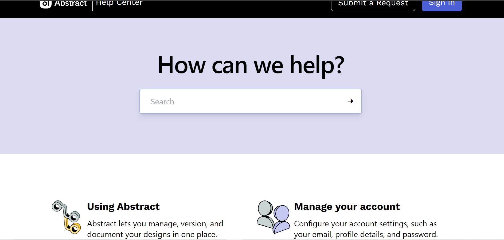

  
  <h2 align="center">Abstract Website</h2>

  This project is a responsive landing page  It was build using HTML, TailWindCSS, and JavaScript.

  <a href="https://samxzhk.github.io/frontend-practice-websites/abstract-website"><strong>➥ Live Demo</strong></a>

 

### Screeshots

Desktop Version

Mobile Version

### Contact

If you want to contact with me you can reach me at [Twitter](https://www.twitter.com/sammdevjs) or at [Linkedin](https://www.linkedin.com/in/samia-cunha)
